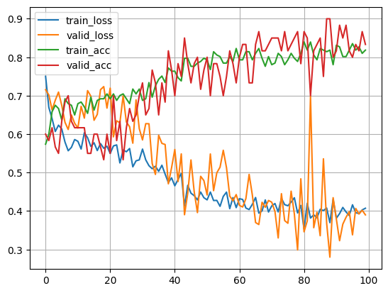

# Heart Disease Prediction with PyTorch

## Overview

```bash

This project uses a vanilla Multilayer Perceptron (MLP) in PyTorch to predict heart disease
presence using the Cleveland Heart Disease dataset.
```
---

## Dataset

```bash

- **Source:** Kaggle — [Heart Disease UCI](https://www.kaggle.com/datasets/redwankarimsony/heart-disease-data)
- **Target:** `condition` (0 = no disease, 1 = disease)
- **Features:** 13 attributes including age, sex, chest pain, blood pressure, etc.
```
---

## Model Architecture
```bash
A 3-layer feedforward network:

    Input → 128 → BatchNorm → ReLU → Dropout
    → 64 → BatchNorm → ReLU → Dropout
    → 1 output (for binary classification)

```
---

## Training Details
```bash

- **Loss:** `BCEWithLogitsLoss`
- **Optimizer:** `Adam (lr=1e-3)`
- **Epochs:** 100
- **Batch Size:** 20 (train), 10 (val)

```
---

## Performance

```bash
- **Train Accuracy:** ~83%
- **Validation Accuracy:** ~82%
```
---

---
## Usage

1. Install dependencies:
```bash
    pip install -r requirements.txt

2. Download heart_cleveland_upload.csv into the project folder.

3. Train and monitor results:
    python train.py

```
---

## Highlights

```bash

. Demonstrates clean PyTorch NN pipeline for tabular data
. Includes modular code and training visualization
. Suitable as a resume portfolio example
```
---
