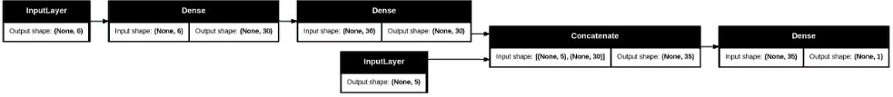
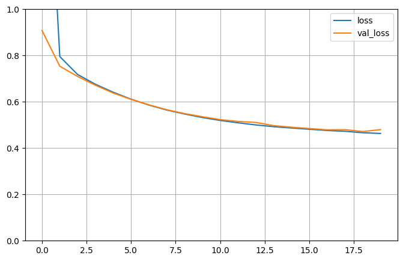

# California Housing Regression using Keras Functional API

This project demonstrates how to use the **Functional API** in Keras for training a non-sequential
multi-input model on the **California Housing** dataset.

---

## Model Architecture

- **Wide Input:** First 5 features  
- **Deep Input:** Last 6 features (starting from feature 2 onward)  
- **Hidden Layers:**  
  - Dense(30, ReLU)  
  - Dense(30, ReLU)  
- **Concatenation:** Wide + Deep paths  
- **Output Layer:** Dense(1) for regression
---

---

## Training Details

- **Loss:** Mean Squared Error (MSE)  
- **Optimizer:** SGD (learning rate = 1e-3)  
- **Epochs:** 20  
- **Batch Size:** 32
---

## Results


        | Stage            | MSE       |
        |------------------|-----------|
        | Before Training  | ~5.37     |
        | After Training   | Improved (depends on run) |
---

---

## Dataset

-  `fetch_california_housing()` from `sklearn.datasets`  
-  Preprocessed with `StandardScaler`  
-  2-level train/valid/test split

---

## How to Run

```bash
pip install tensorflow scikit-learn numpy pandas matplotlib
python train.py
```
---

## Key Takeaways

    . Showcases use of Keras Functional API for non-sequential models
    . Demonstrates how to merge multiple input branches
    . Real-world dataset for regression
---

