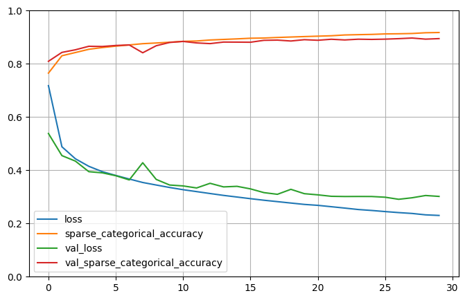

# Fashion MNIST Classification using Keras Sequential API

```bash
This example demonstrates the use of Keras’s **Sequential API** to train a deep neural network for
image classification on the **Fashion MNIST** dataset.
```
---

## Model Architecture
```bash
    input (28x28) → Flatten
    → Dense(300, ReLU)
    → Dense(100, ReLU)
    → Dense(10, Softmax)


- **Loss Function:** Sparse Categorical Crossentropy  
- **Optimizer:** Stochastic Gradient Descent (SGD)  
- **Metric:** Sparse Categorical Accuracy
```
---

## Results
```bash

        | Stage            | Accuracy |
        |------------------|----------|
        | Before Training  | ~8.5%    |
        | After Training   | ~88.0%   |
```
---

---

## Prediction Visualization

```bash
The script includes a function that shows:
- ❌ Wrong predictions
- ✅ Correct predictions  
...with class names and ground truth side by side.
```
---

---

## Requirements

```bash
pip install tensorflow numpy matplotlib pandas
```
---
## How to Run
```bash
    python train.py
```
---

## Summary

```bash
This project highlights:
    . How to use Keras's Sequential API
    . Clean separation of architecture (model.py) and training logic (train.py)
    . Custom prediction visualizations for model inspection
```
---
