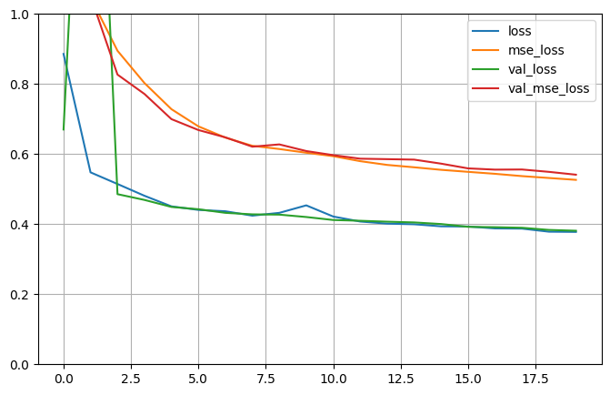

# California Housing Regression using Keras Subclassing API

```bash
This project demonstrates a **custom Keras model** using the **Subclassing API**, applied to
the California Housing dataset for regression.
```
---

##  Model Design
```bash
- Two inputs:  
  - `Wide input` — first 5 features  
  - `Deep input` — from feature 2 onward  
- Two Dense hidden layers on the deep input  
- Concatenation of wide + deep paths  
- Two outputs:
  - Main output (used for primary prediction)
  - Auxiliary output (used for regularization)
```
---

## 🏗️ Architecture Diagram

```bash

   Wide Input ─────┐
                   ├─► [Concat] ─► Dense(1) → Main Output
                   
    Deep Input → Dense → Dense ┘
    └────────────► Dense(1) → Aux Output
```
---

## Training Setup
```bash

- **Losses:** MSE on both outputs  
- **Loss weights:** 0.9 (main) / 0.1 (auxiliary)  
- **Optimizer:** SGD  
- **Epochs:** 20  
```
---

## Results
```bash

    | Stage            | MSE       |
    |------------------|-----------|
    | Before Training  | ~4.89     |
    | After Training   | ~0.39     |

```
---

---

## How to Run

```bash
pip install tensorflow scikit-learn numpy pandas matplotlib
python train.py
```
---

## Highlights

```bash
    . Shows advanced Keras modeling using Subclassing API
    . Custom evaluation logic to bypass Keras evaluation API limitations with multiple outputs
    . Multi-input, multi-output design pattern with weighted loss

```
---
