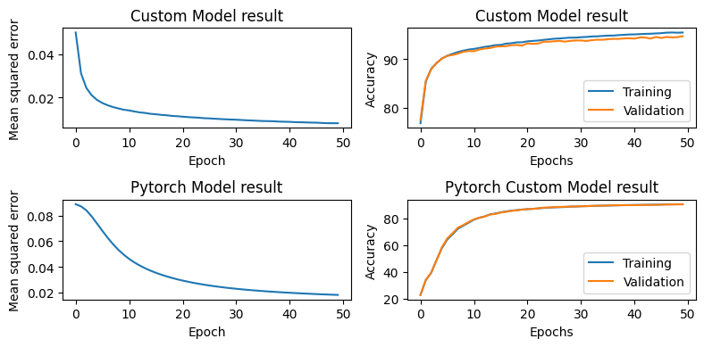
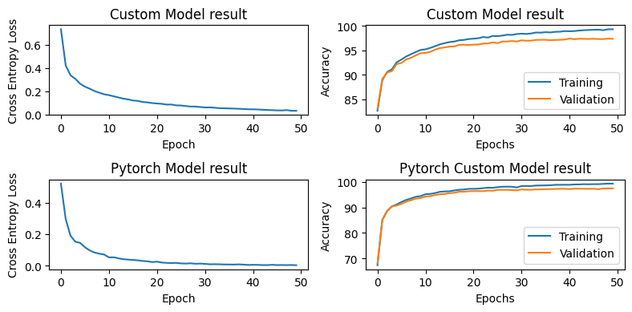

# MLP from Scratch (Single and Two Hidden Layers): Classifying MNIST Digits

```bash
This project implements a **Multi-Layer Perceptron (MLP)** from scratch using **NumPy**,
and compares it to an equivalent **PyTorch implementation** — both trained on the MNIST
handwritten digit dataset.It supports models with either a single hidden layer or two hidden
layers, enabling experimentation with deeper architectures.

```
---

## Project Highlights
```bash
- Neural network (MLP) implemented **from scratch** with support for:
    - Single hidden layer
    - Two hidden layers (extended model)
- PyTorch equivalent models for both single and two-layer MLPs for performance comparison
- Visualizations of accuracy and loss across epochs for all models
- Final test accuracy:
    - **Custom NumPy single-layer model:** ~94.88%
    - **Custom NumPy two-layer model:** ~97.53
    - **PyTorch single-layer model:** ~90.63%
    - **PyTorch two-layer model:** ~97.50
- Modular and extensible codebase for easy experimentation with network depth and hyperparameters
```
---

## Tech Stack

```bash
    | Component      | Library       |
    |----------------|----------------|
    | Dataset        | `scikit-learn` (MNIST via `fetch_openml`) |
    | Core Logic     | `NumPy`, `PyTorch` |
    | Visualization  | `matplotlib` |
    | Splitting & Metrics | `scikit-learn` |
    
```
---

##  Repository Structure

```bash
    mlp_from_scracth/
        ├── demo.ipynb              # Notebook walkthrough with plots and conclusion
        ├── demo_script.py          # Script version of the notebook
        ├── requirements.txt        # All dependencies
        ├── utils.py                # Accuracy, loss, plotting, one-hot encoding, collate
        ├── training.py             # Training loops for custom and PyTorch models
        ├── models                  # custom and pytorch models

```
---

## Getting Started

### 1. Install dependencies
```bash
    pip install -r requirements.txt
```
### 2. Train the agent
```bash
    . Use demo_script.py to test a trained agent quickly.
    . Explore demo.ipynb for an interactive walkthrough and analysis.

```
---

## Training Results

```bash
### One hidden layer

        | Model       | Test Accuracy |
        | ----------- | ------------- |
        | NumPy MLP   | **94.88%**    |
        | PyTorch MLP |   90.63%      |
```
---

---
    ### Two hidden layers

        | Model       | Test Accuracy |
        | ----------- | ------------- |
        | NumPy MLP   | **97.53%**    |
        | PyTorch MLP |   97.50%      |
---


```
---
## What You’ll Learn

```bash
. How forward and backward propagation are implemented manually for single and two-layer MLPs
. How to train neural networks using only NumPy, without relying on deep learning frameworks
. Differences in training behavior and performance between custom NumPy implementations and PyTorch models
. How to structure clean, modular ML projects for easy extension and experimentation with model depth

```
